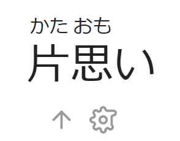
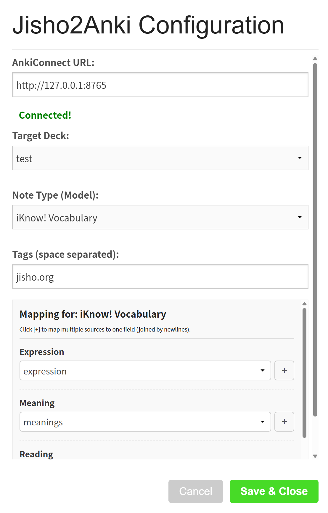

# Jisho2Anki User Guide

Disclaimer: This script and this documentation are generated by Gemini, reviewed by human

**Jisho2Anki** is a powerful Userscript designed to streamline the vocabulary mining process for Japanese learners. It enables one-click importing of words from [Jisho.org](https://jisho.org) directly into **Anki** via AnkiConnect, featuring highly customizable field mapping to capture expressions, readings, meanings, and sentence examples automatically.

---

## 1. Prerequisites

Before using the script, ensure your environment is set up correctly:

1.  **Anki Desktop**: Ensure the Anki desktop application is installed and running.
2.  **AnkiConnect Add-on**: This is required for the script to communicate with Anki.
    * Open Anki and navigate to `Tools` -> `Add-ons` -> `Get Add-ons...`.
    * Enter the code: `2055492159`.
    * **Important**: Restart Anki after installation. Anki must be running in the background for the script to work.
3.  **Userscript Manager**: Install a browser extension such as **Tampermonkey** or **Violentmonkey**.

---

## 2. Configuration

You only need to configure the script once to tell it where to send your cards and how to format them.

1.  Open [Jisho.org](https://jisho.org) and search for any word.
2.  Locate the new icons (an **Upload Arrow** and a **Settings Gear**) next to the vocabulary entry.

3.  Click the **Gear Icon** to open the configuration panel.

### Settings Overview

* **AnkiConnect URL**: Default is `http://127.0.0.1:8765`. If the status shows a green **Connected!**, no changes are needed.
* **Target Deck**: Select the Anki deck where you want new cards to be created.
* **Note Type (Model)**: Select the Note Type you use for vocabulary (e.g., "Core 2k/6k", "Japanese Basic").
* **Tags**: Define tags to be automatically added to new cards (space-separated). Default is `jisho.org`.

### Field Mapping (Core Feature)

This section allows you to map Jisho data to your specific Anki Note Type fields.

* **Mapping Data**: Use the dropdown menus to select which Jisho data corresponds to which Anki field (e.g., map Jisho's `reading` to Anki's `Kana` field).
* **Multi-Source Fields**: If you want to combine multiple pieces of data into a single Anki field (e.g., putting both "Meanings" and "Notes" into one field), click the **`+`** button next to the dropdown.
    * This adds a second slot for that field.
    * Data from multiple sources will be joined by a new line in the final card.
* **Ignoring Fields**: If a field should remain empty, select `-- Ignore --`.

Click **Save & Close** to apply your changes.

---

## 3. Usage

Once configured, adding words is seamless.

1.  Search for a word on Jisho.org.
2.  Click the **Upload Icon** (the Up Arrow) located next to the gear icon.

### Status Indicators

* **Loading**: The icon changes to a spinner while data is being processed.
* **✅ Success**: The icon turns into a green checkmark. The note has been created in Anki. (The script automatically prevents duplicates within the selected deck).
* **❌ Error**: The icon turns into a red X. Please check if Anki is running and if your configuration is correct.

---

## 4. Available Data Sources

The script extracts the following data points for mapping:

* **Expression**: The word as written (Kanji/Kana).
* **Reading**: The full reading in Kana (Furigana and Okurigana are merged correctly).
* **Meanings**: A formatted block containing parts of speech, English definitions, and example sentences.
* **Other forms**: Alternative spellings or kanji variations.
* **Notes**: Specific usage notes, tags (e.g., "archaic"), or nuances provided by Jisho.

---

## 5. Troubleshooting

* **"Connection Failed" Status**:
    * Ensure Anki is running.
    * Ensure the AnkiConnect add-on is installed.
    * Check if your firewall is blocking port 8765.

* **Fields are empty in Anki**:
    * Re-open the configuration (Gear icon) and check the **Field Mapping** section. Ensure you have selected a valid source for every Anki field you wish to populate.

* **Do I need to refresh after saving settings?**
    * No, changes are applied immediately after clicking "Save & Close".
